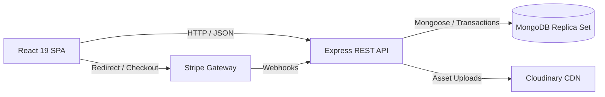

# Fullstack TypeScript E-Commerce Platform

A production-grade e-commerce application built with React 19, Node.js, Express, TypeScript, and MongoDB. The system features atomic inventory management via MongoDB Transactions, secure dual-token authentication, Stripe payment webhooks with idempotency protection, and an administrative fulfillment state machine.

[Live Demo](https://mern-ecommerce-frontend.vercel.app) · [API Documentation (Swagger)](http://localhost:5000/api-docs) · [GitHub Repository](https://github.com/username/E-Commerce_Fullstack)

## 📑 Table of Contents
- [Screenshots](#-screenshots)
- [Technical Highlights](#-technical-highlights)
- [Tech Stack](#️-tech-stack)
- [Features](#-features)
- [Architecture](#-architecture)
- [Authentication](#-authentication)
- [Payment & Inventory Flow](#-payment--inventory-flow)
- [Order Flow](#-order-flow)
- [API Documentation](#-api-documentation)
- [Project Structure](#-project-structure)
- [Getting Started](#-getting-started)
- [Testing](#-testing)
- [Deployment & CI/CD](#-deployment--cicd)
- [License](#-license)

## 📸 Screenshots

| Storefront Desktop | Mobile Experience |
| :---: | :---: |
|  |  |

## ⭐ Technical Highlights

- **Atomic Inventory & MongoDB Transactions**: Decrements stock within multi-document transactions during webhook processing, using deterministic product ID sorting to eliminate database deadlocks.
- **Webhook Idempotency & Fault Recovery**: Tracks provider event IDs via a dedicated model to prevent duplicate fulfillment; routes payment discrepancies to an explicit `PAYMENT_REVIEW` status.
- **Dual-Token Authentication**: Short-lived in-memory JWT access tokens combined with rotated, HttpOnly, SameSite refresh token cookies and token-family revocation.
- **Optimistic Concurrency Control**: Admin order transitions enforce expected current status to prevent race conditions and concurrent state overwrite conflicts.
- **Layered TypeScript Architecture**: Strict domain separation across modular backend services and feature-based React frontend architecture.
- **Automated Testing & CI/CD**: End-to-end type safety, unit and integration tests with Vitest, Supertest, and React Testing Library running on GitHub Actions.

## 🛠️ Tech Stack

| Domain | Technologies |
| :--- | :--- |
| **Frontend** | React 19, TypeScript, Vite, TanStack Query v5, Zustand, React Router v7, Axios |
| **Backend** | Node.js, Express, TypeScript, Mongoose (MongoDB ORM), Helmet, Express Rate Limit |
| **Payments & Cloud** | Stripe API, MoMo API, Cloudinary (Image Management) |
| **Testing** | Vitest, Supertest, React Testing Library |
| **DevOps & Infra** | Docker Compose (MongoDB Replica Set `rs0`), GitHub Actions, Vercel, Render |

## ✨ Features

### Customer
- Product catalog browsing with search, multi-criteria filtering, price ranges, and URL-synced pagination.
- Server-synchronized shopping cart with real-time price and stock validation.
- Secure Stripe Checkout and MoMo gateway integrations with payment status polling.
- Order history with itemized line snapshots and real-time delivery status tracking.
- Email verification and password recovery flows.

### Admin
- Product catalog and category lifecycle management with Cloudinary image uploads.
- Real-time inventory tracking and stock adjustments.
- Order status fulfillment pipeline protected by strict transition rules.
- Centralized dashboard displaying revenue metrics, order volumes, and low-stock alerts.
- Dedicated review queue for flagged payment orders (`PAYMENT_REVIEW`).

## 🏗️ Architecture



- **Frontend**: Client-side single-page app utilizing TanStack Query for server cache management and Zustand for lightweight session state.
- **Backend**: Modular REST API with centralized error handling, request validation, and rate limiting middleware.
- **Data Layer**: MongoDB configured with a single-node replica set (`rs0`) to support ACID transactions across orders, payments, and inventory.
- **Third-Party Services**: Asynchronous event-driven webhooks for payment processing and Cloudinary for media storage.

## 🔐 Authentication

Authentication uses a dual-token strategy to maximize security against XSS and CSRF:

1. **Access Token**: Short-lived JWT (15 minutes) kept exclusively in frontend memory via Zustand; never stored in `localStorage` or `sessionStorage`.
2. **Refresh Token**: Cryptographically random opaque token stored in an `httpOnly`, `SameSite=Lax` cookie scoped strictly to `/api/v1/auth`.
3. **Rotation & Revocation**: Every refresh cycle issues a new token family member and revokes previous tokens. Replay detection invalidates compromised token families.
4. **Role-Based Access Control (RBAC)**: Route middleware validates user roles (`CUSTOMER` vs `ADMIN`) before dispatching requests to controllers.

> For deep architectural details, see [`docs/authentication-flow.md`](docs/authentication-flow.md).

## 💳 Payment & Inventory Flow

```text
Customer Checkout
       ↓
Create Immutable Order & Pending Payment
       ↓
Redirect to Stripe Checkout Session
       ↓
Stripe Webhook (`checkout.session.completed`)
       ↓
Idempotency Check (`PaymentWebhookEvent`)
       ↓
MongoDB ACID Transaction:
  ├── Check Stock Availability
  ├── Atomic Inventory Decrement ($inc: -qty)
  └── Update Order & Payment Status -> PAID
       ↓ (If stock depleted during checkout)
Mark Order as `PAYMENT_REVIEW` for Admin Intervention
```

- **Stock Reservation Policy**: Stock is not reserved upon checkout session creation. Instead, inventory is atomically decremented during webhook verification.
- **Deadlock Avoidance**: Order line items are sorted by `productId` prior to executing transactional updates, guaranteeing deterministic lock acquisition.
- **Fault Recovery**: If an order was paid but concurrent orders depleted the available stock, the order transitions to `PAYMENT_REVIEW` with full audit logs rather than failing silently.

> For complete sequence diagrams, see [`docs/payment-flow.md`](docs/payment-flow.md).

## 🔄 Order Flow

Order progression follows a deterministic state machine:

```text
PENDING ──► PROCESSING ──► SHIPPED ──► COMPLETED
   │             │             │
   └──► CANCELLED └──► CANCELLED└──► RETURNED
```

- Transitions are enforced on the backend via a transition lookup matrix.
- Updates require `expectedCurrentStatus` in the request payload; mismatched states return `409 ORDER_STATUS_CONFLICT` to prevent concurrent administrative overwrites.
- Customer cancellations are only permitted while the order remains in `PENDING` state.

## 🔌 API Documentation

Complete interactive OpenAPI/Swagger documentation is available when running the backend:

- **Swagger UI**: `http://localhost:5000/api-docs`
- **Core Endpoints**: Auth (`/api/v1/auth`), Products (`/api/v1/products`), Categories (`/api/v1/categories`), Cart (`/api/v1/cart`), Orders (`/api/v1/orders`), Payments (`/api/v1/payments`), Admin (`/api/v1/admin`)
- **Health Checks**: `GET /api/v1/health` (Liveness) and `GET /api/v1/ready` (Readiness check verifying database and payment services).

## 📂 Project Structure

```text
E-Commerce_Fullstack/
├── backend/
│   ├── src/
│   │   ├── common/        # Middleware (auth, error, rate-limit), logger, utilities
│   │   ├── config/        # Environment and database connection configurations
│   │   ├── database/      # Mongoose schemas, enums, indexes, and seed scripts
│   │   ├── modules/       # Domain modules (auth, catalog, cart, orders, payments, admin)
│   │   ├── app.ts         # Express application bootstrap
│   │   └── server.ts      # Server entry point
│   ├── test/              # Integration and unit test suites
│   └── Dockerfile         # Production multi-stage build
├── frontend/
│   ├── src/
│   │   ├── components/    # Reusable design system UI elements
│   │   ├── features/      # Feature modules (auth, catalog, cart, checkout, admin)
│   │   ├── layouts/       # Storefront and admin layout wrappers
│   │   ├── lib/           # API client (Axios) and TanStack Query client configuration
│   │   └── routes/        # Application router definitions
│   └── test/              # Frontend unit and component tests
├── docs/                  # Architecture Decision Records (ADRs) and workflow specs
├── screenshots/           # Storefront preview captures
└── docker-compose.yml     # MongoDB Single-Node Replica Set service
```

## 🚀 Getting Started

### Prerequisites
- **Node.js**: v20+
- **pnpm**: v9.15+
- **Docker**: For running the MongoDB Replica Set

### 1. Clone and Install
```bash
git clone https://github.com/username/E-Commerce_Fullstack.git
cd E-Commerce_Fullstack
pnpm install
```

### 2. Configure Environment Variables
Copy the sample environment files:
```bash
cp backend/.env.example backend/.env
cp frontend/.env.example frontend/.env
```
Key backend variables (`backend/.env`):
```env
PORT=5000
MONGODB_URI=mongodb://localhost:27017/mern_ecommerce?replicaSet=rs0
CLIENT_URL=http://localhost:5173
JWT_ACCESS_SECRET=your_jwt_secret
STRIPE_SECRET_KEY=sk_test_your_key
STRIPE_WEBHOOK_SECRET=whsec_your_secret
```

### 3. Start Database and Seed
MongoDB Transactions require a replica set:
```bash
# Start MongoDB replica set
docker compose up -d mongodb

# Sync database indexes and seed initial data
pnpm db:indexes
pnpm db:seed
```

### 4. Run Application
```bash
# Start both backend and frontend concurrently
pnpm dev
```
- Frontend: `http://localhost:5173`
- Backend API: `http://localhost:5000`

### Demo Credentials
Pre-seeded accounts for review and evaluation:

| Role | Email | Password | Access Area |
| :--- | :--- | :--- | :--- |
| **Admin** | `admin@example.com` | `ChangeMe123!` | Admin Dashboard (`/admin`) |
| **Customer** | `customer@example.com` | `ChangeMe123!` | Storefront & Checkout (`/`) |

## 🧪 Testing

The repository maintains automated test suites covering critical business flows:

```bash
# Run unit tests across all packages
pnpm test

# Run database integration tests (orders, payments, transactions)
pnpm test:integration

# Run type check and linting
pnpm type-check
pnpm lint
```
- **Backend**: Vitest + Supertest testing controllers, services, database transactions, and auth security.
- **Frontend**: Vitest + React Testing Library testing state stores, custom hooks, and UI interactions.

## 🚀 Deployment & CI/CD

- **Frontend**: Deployed on Vercel with client-side route rewrites (`vercel.json`).
- **Backend**: Containerized via multi-stage Dockerfile and deployed on Render.
- **Database**: Hosted on MongoDB Atlas.
- **CI/CD Pipeline**: GitHub Actions (`.github/workflows/ci.yml`) runs on every push and PR to `main`, validating linting, TypeScript compilation, replica set database integration tests, and production builds.

## 📄 License

This project is developed for educational and portfolio demonstration purposes under the MIT License.
