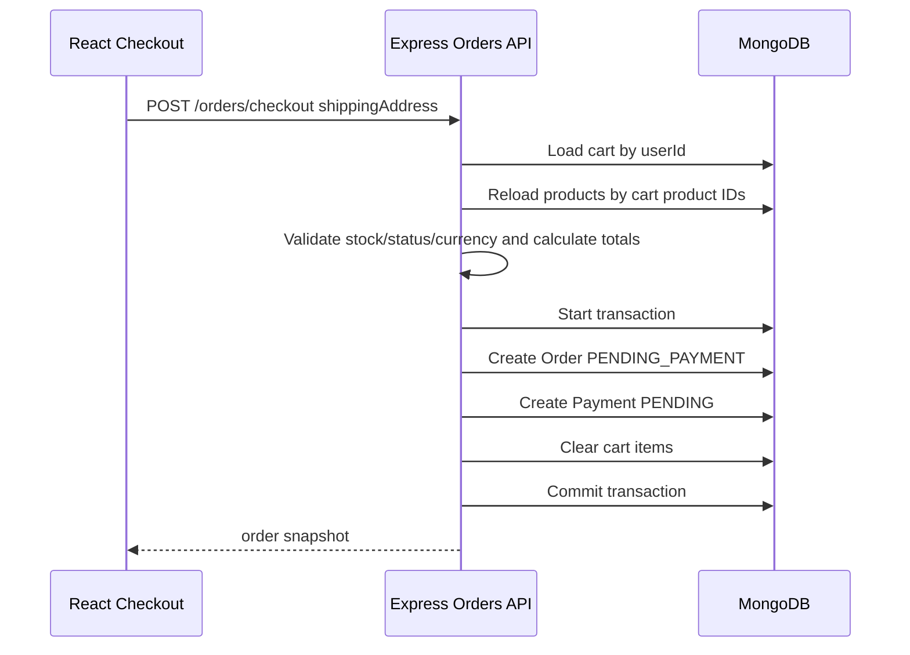

# Checkout Flow

Phase 7 creates pending orders from authenticated customer carts. Phase 8/9 connect those orders to Stripe Checkout and move inventory consumption to the verified Stripe webhook success workflow.

## API

```http
POST /api/v1/orders/checkout
GET  /api/v1/orders?page=1&limit=10
GET  /api/v1/orders/:orderId
```

Order routes require a valid `CUSTOMER` access token. User ownership always comes from the token.

## Checkout Sequence



## Rules

- The frontend sends only the shipping address.
- Product names, slugs, image URL, prices, line totals, subtotal and total are calculated from current server data.
- Order items and shipping address are stored as immutable snapshots.
- Payment is created as `STRIPE` + `PENDING` without provider IDs.
- Product stock is checked during checkout for user feedback, but checkout does not reserve or decrement inventory.
- Cart is cleared only when the transaction commits.
- Phase 7 does not use a stock reservation collection or TTL.
- Inventory consumption happens later in the verified Stripe webhook success transaction.
- Customer order list/detail filters by `userId`; another user's order returns `ORDER_NOT_FOUND`.

## Transaction Boundary

The checkout transaction includes order creation, payment creation and cart clearing. It does not include stock decrement, external network calls, Stripe calls, logging side effects or stock reservation TTL behavior.

## Admin Follow-Up

Phase 10 adds admin order reads and status transitions at `/api/v1/admin/orders`. Customer order endpoints remain ownership-scoped to the current customer.
